# 算法

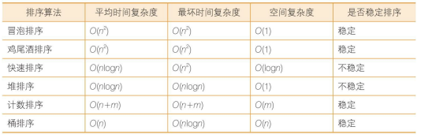  

## 1 时间复杂度

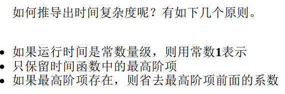  

## 排序算法

依据时间复杂度，对排序算法分类  
时间复杂度为O(n2)的排序算法  
*冒泡排序*  
选择排序  
插入排序  
希尔排序（希尔排序比较特殊，它的性能略优于O(n2)，但又比不上O(nlogn)，姑且把它归入本类）  

时间复杂度为O(nlogn)的排序算法  
*快速排序*  
归并排序  
*堆排序*  

时间复杂度为线性的排序算法  
*计数排序*  
*桶排序*  
基数排序  

排序算法还可以根据其稳定性，划分为 *稳定排序和不稳定排序*。  
如果值相同的元素在排序后仍然保持着排序前的顺序，则这样的排序算法是稳定排序；如果值相同的元素在排序后打乱了排序前的顺序，则这样的排序算法是不稳定排序  

### 1 冒泡排序

bubble sort  
冒泡排序的思想，我们要把 *相邻的元素两两比较* ，当一个元素大于右侧相邻元素时，交换它们的位置；当一个元素小于或等于右侧相邻元素时，位置不变  

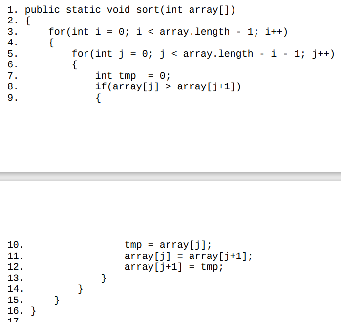  
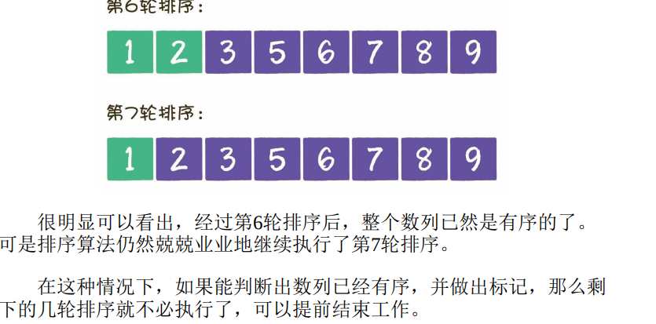  
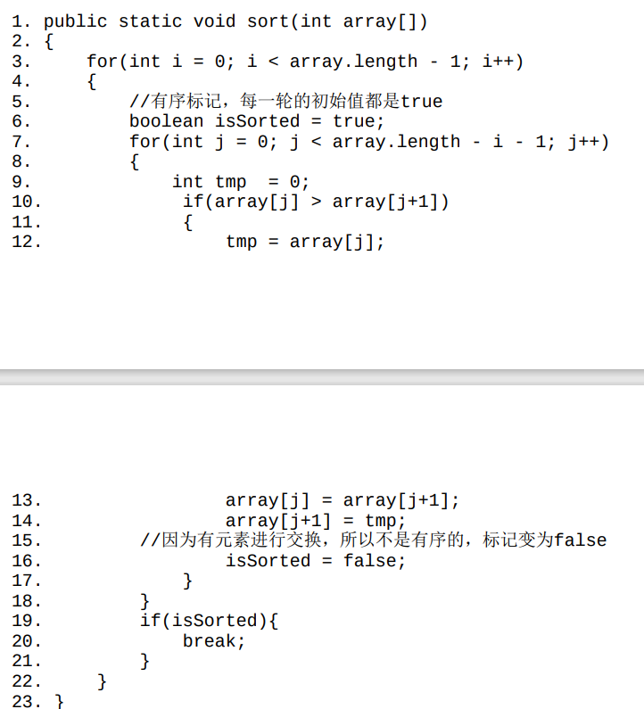  
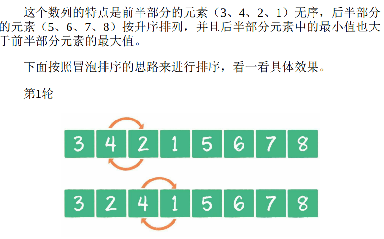  
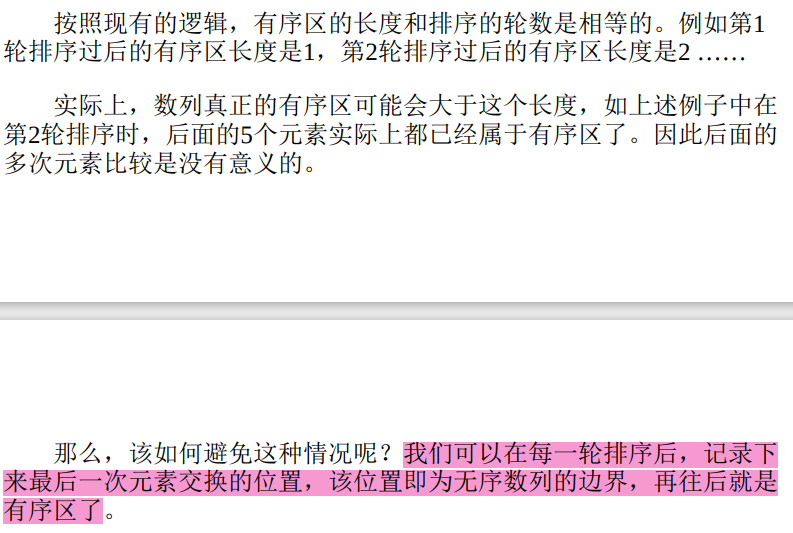  
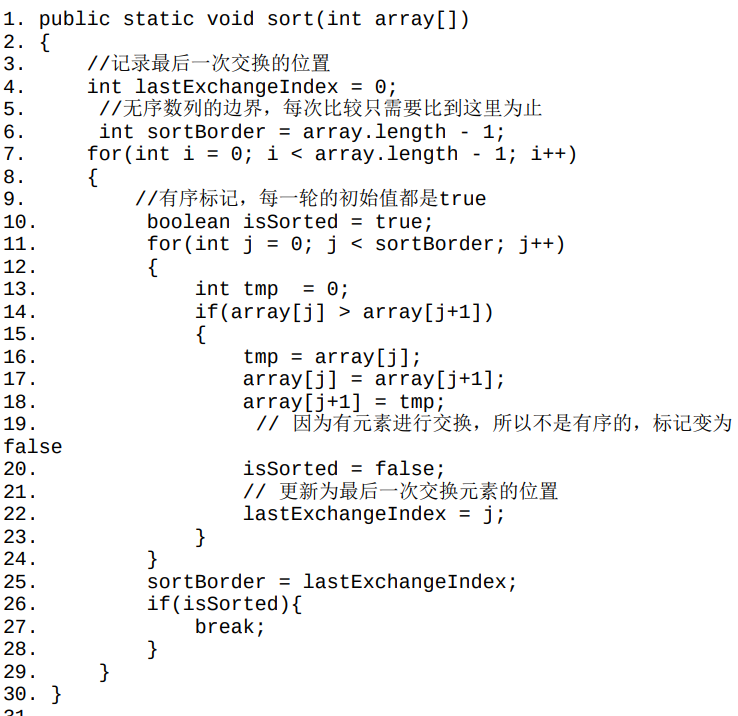  

### 2 鸡尾酒排序

同冒泡排序比，鸡尾酒排序的比较和交换过程是双向的  
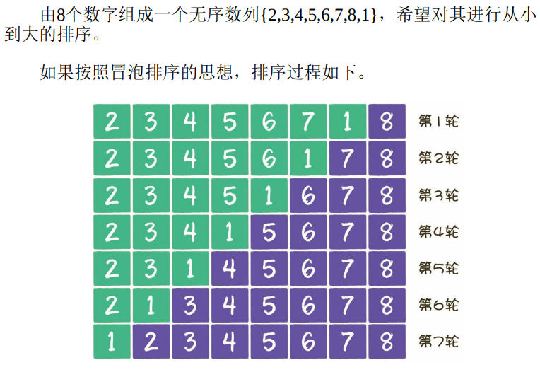  
元素2、3、4、5、6、7、8已经是有序的了，只有元素1的位置不对，却还要进行7轮排序，这也太“憋屈”了吧  
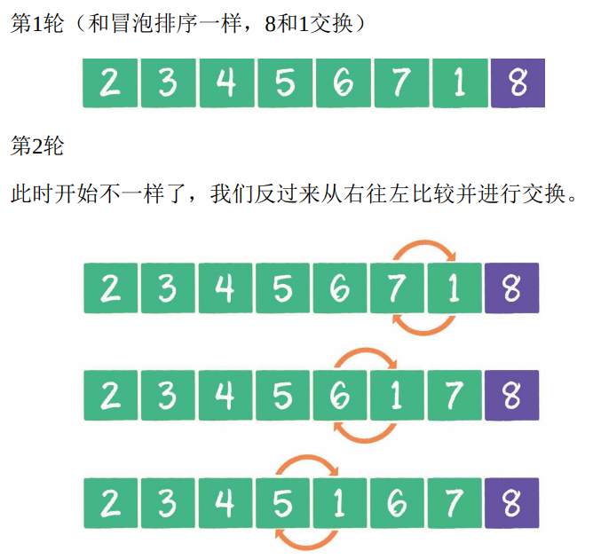  
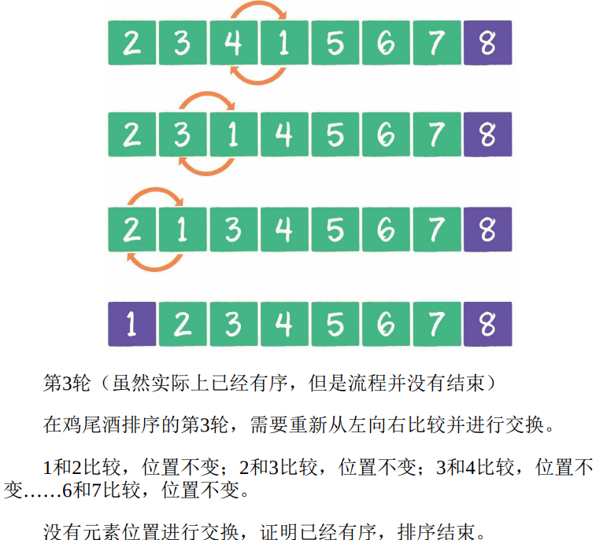  

鸡尾酒排序：排序过程就像钟摆一样，第一轮从左到右，第二轮从右到左，第三轮再从左到右...  

鸡尾酒排序优势：大部分元素已经有序的情况  

### 3 快速排序

由冒泡排序演变来，使用分治法。 平均时间复杂度O(nlogn)，最坏情况下为O(n2)  
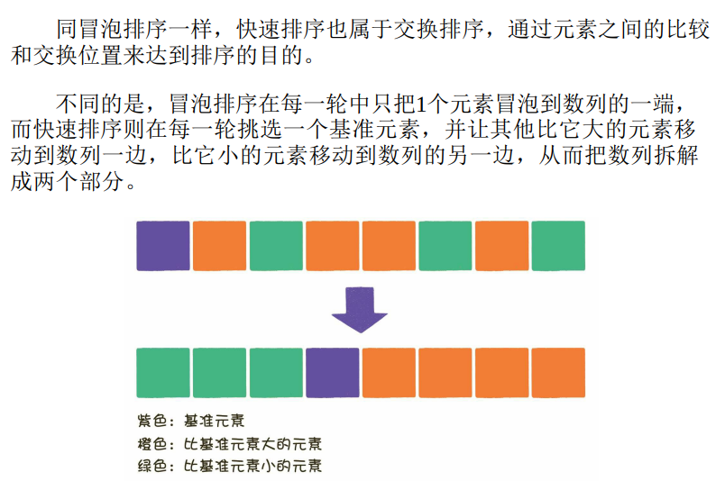  

基准元素的选择，元素的交换 是快速排序法的核心  
随机选择一个基准元素，并使基准元素与数列首元素交换位置。  

元素的交换：双边循环法（left, right）两个指针，单边循环法（一个mark）  

#### 非递归实现

***绝大多数递归逻辑，都可以用栈的方式来代替***  

非递归的变动发生在 quickSort 方法中，引入一个存储Map类型元素的栈，用于存储每一次交换时的起始下标和结束下标  
每一次循环，都会让栈顶元素出栈，通过partition方法进行分治，并且按照基准元素的位置分成左右两部分，左右两部分再分别入栈。当栈为空时，说明排序已经完毕，退出循环  
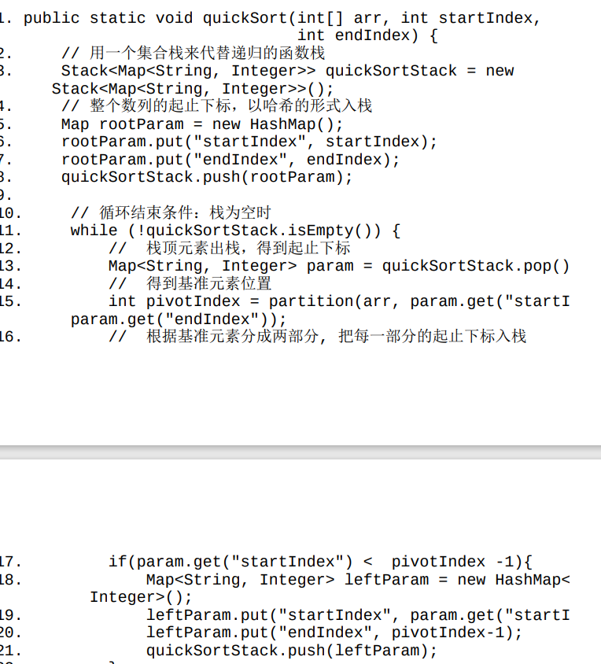  

### 4 堆排序

二叉堆的构建、删除、自我调整等操作实现了堆排序的基础。  

二叉堆删除堆顶操作：1. 堆顶与末尾节点交换 2. 末尾节点保留 3. 自我调整  
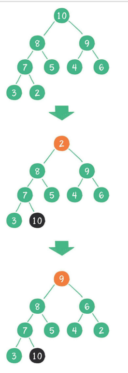  

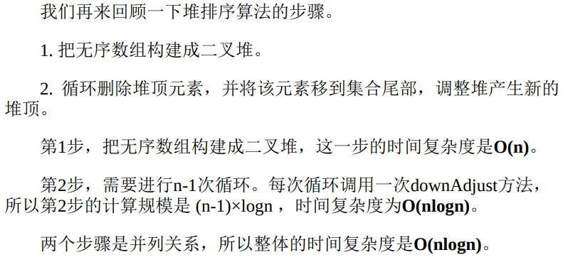  

### 5 计数排序和桶排序

线性时间的排序  
前述都是基于比较的排序，利用数组下标来确定元素的正确位置。  

#### 计数排序

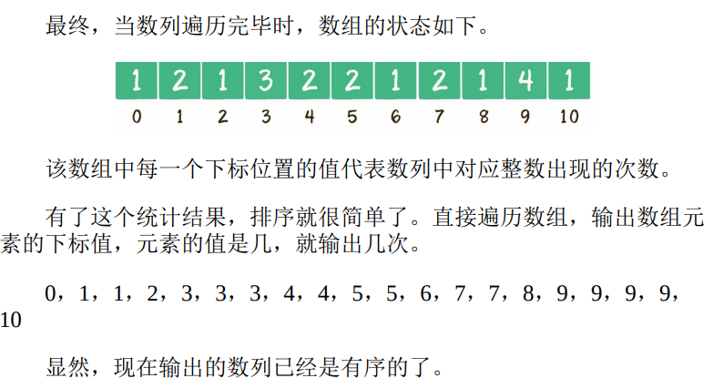  

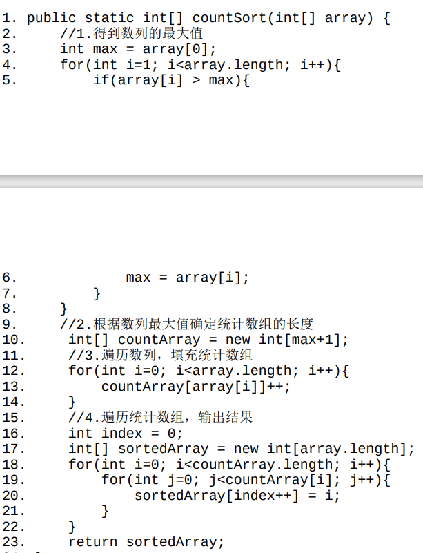  
这段代码在开头有一个步骤，就是求数列的最大整数值max。后面创建的统计数组countArray，长度是max+1，以此来保证数组的最后一个下标是max  

问题：只考虑数列中存储的最大值，当数值较为离散时，很浪费空间  

解决：只要不再以输入数列的最大值+1作为统计数组的长度，而是以数列最大值-最小值+1作为统计数组的长度可。  
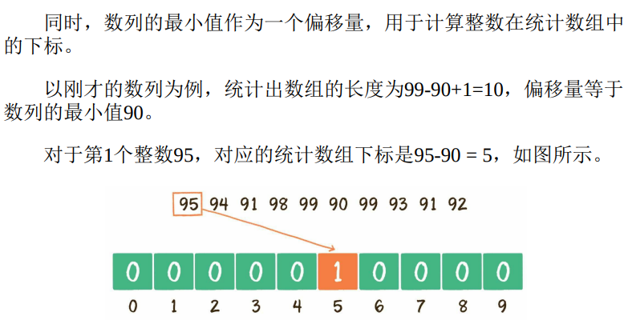  

朴素版的计数排序只是简单地按照统计数组的下标输出元素值，并没有真正给原始数列进行排序。如果只是单纯地给整数排序，这样做并没有问题。但如果在现实业务里，例如给学生的考试分数进行排序，遇到相同的分数就会分不清谁是谁。  
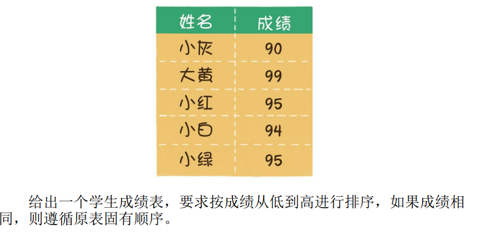  
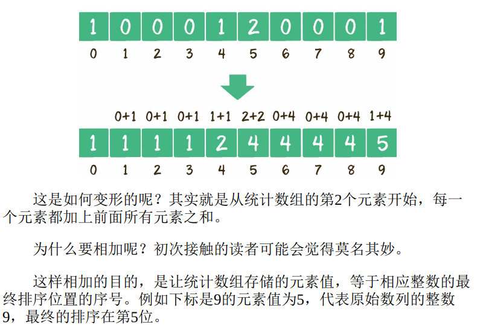  

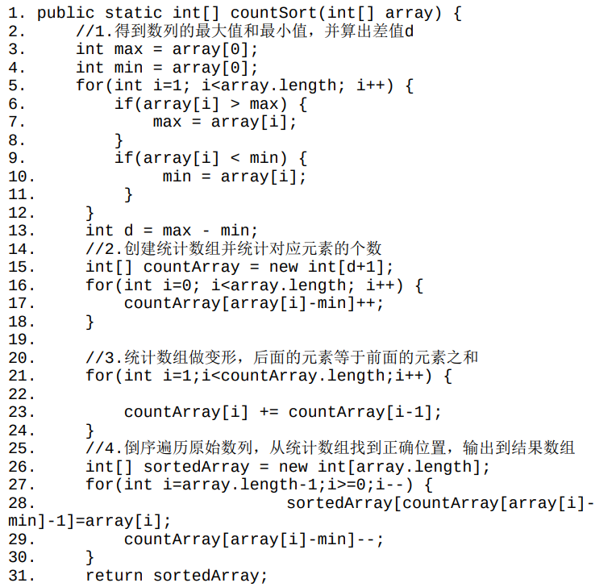  

如果原始数列的规模是n，最大和最小整数的差值是m代码第1、2、4步都涉及遍历原始数列，运算量都是n，第3步遍历统计数列，运算量是m，所以总体运算量是3n+m，去掉系数，时间复杂度是O(n+m)。空间复杂度，如果不考虑结果数组，只考虑统计数组大小的话，空间复杂度是O(m)。  

计数排序缺点：

1. 数列最大和最小值差距过大时，严重浪费空间，时间复杂度也提高  
2. 当数列元素不是整数时，也不适合用计数排序  

#### 桶排序

拯救计数排序  
类似于计数排序所创建的统计数组，桶排序需要创建若干个 *桶* 来协助排序。  
桶：代表一个区间范围，里面可以承载一个或多个元素  

1. 创建这些桶，并确定每一个桶的区间范围。  
2. 遍历原始数列，把元素对号入座放入各个桶中。
3. 对每个桶内部的元素分别进行排序。
4. 遍历所有的桶，输出所有元素。

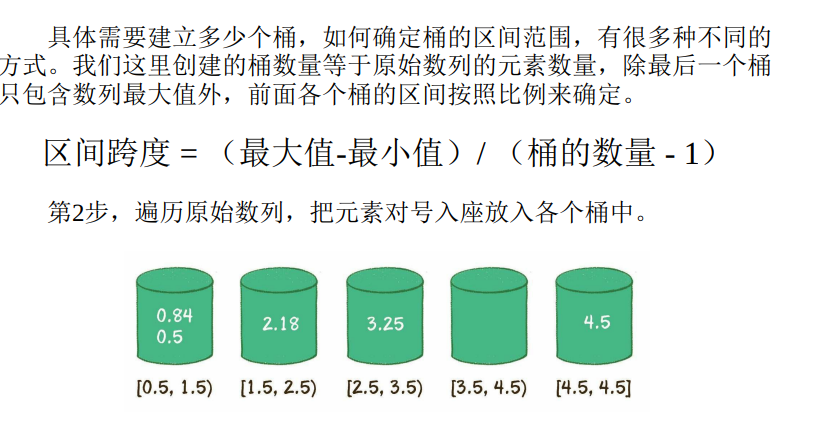  
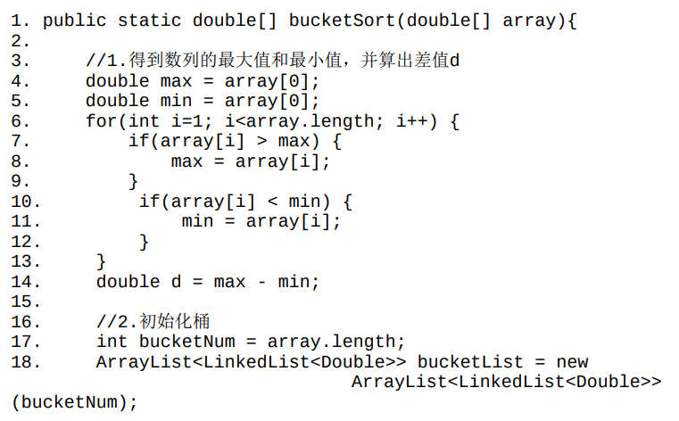  
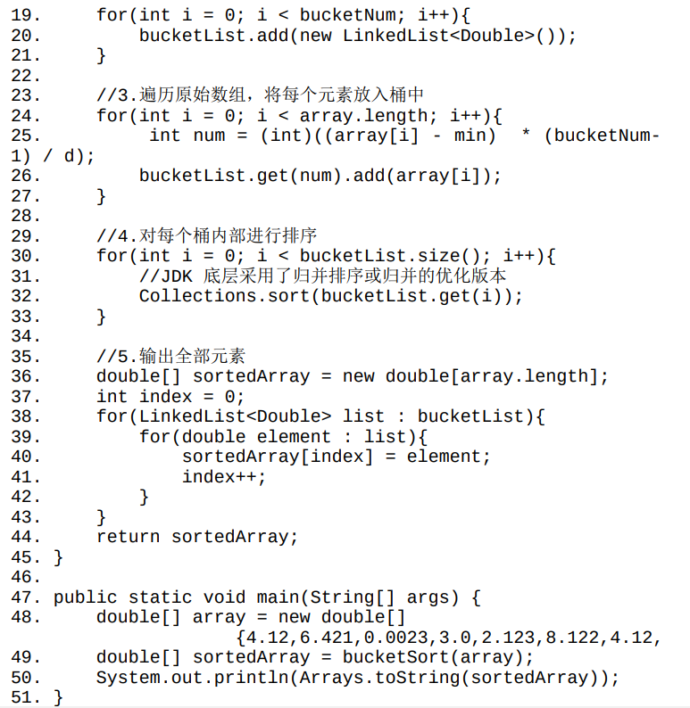  
