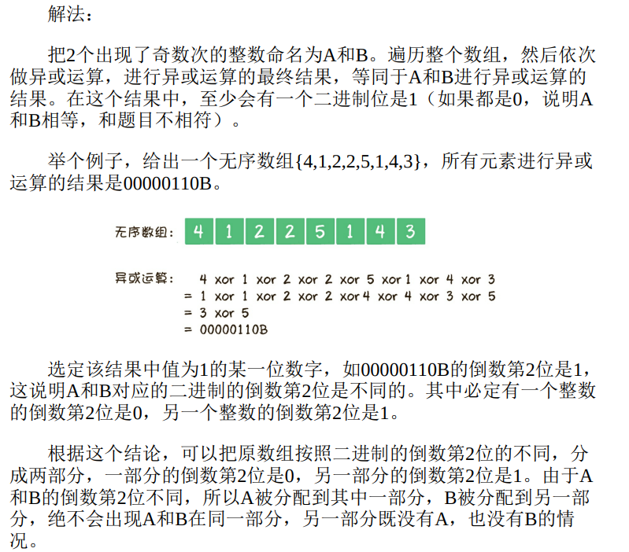

# 漫画算法

## 1 判断链表有环

正常算：的时间复杂度为O(n2)。空间复杂度为O(1)。  

创建哈希表：本质区别使用hashset作为额外的缓存。时间复杂度是O(n)，空间复杂度同样是O(n)。  

*重点：创建两个指针p1和p2*  
在循环体中，让指
针p1每次向后移动1个节点，让指针p2每次向后移动2个节点，然后比较两个指针指向的节点是否相同。  
假设链表的节点数量为n，则该算法的时间复杂度为O(n)。除两个指针外，没有使用任何额外的存储空间，所以空间复杂度是O(1)。  
  

**问题扩展**例

1. 如果链表有环，如何求出环的长度  
2. 如果链表有环，如何求出入环节点  

  
  

## 2 最小栈的实现

只暂存一个最小值是不够的，需要存储栈中曾经的最小值，作为“备胎”。  
创建另一个栈存放每次操作后的最小值  
  

  
  

## 3 求最大公约数

辗转相除法：求两个正整数的最大公约数  
定理：两个正整数a和b(a>b),他们的最大公约数等于a除以b的余数c和b之间的最大公约数  
直到两个数可以整除，或其中一个数减小到1  

  

更相减损术：两个正整数a和b（a>b），它们的最大公约数等于a-b的差值c和较小数b的最大公约数。例如10和25，25减10的差是15，那么10和25的最大公约数，等同于10和15的最大公约数。  
直到两个数可以相等，最大公约数就是最终相等的这两个数的值。  
  

缺点：不稳定，两数相差悬殊时，递归次数太多。  

***最优方法：把辗转相除法和更相减损术的优势结合起来，在更相减损术的基础上使用移位运算。***  
  
  

在上述代码中，判断整数奇偶性的方式是让整数和1进行与运算，如果(a&1)==0，则说明整数a是偶数；如果(a&1)!=0，则说明整数a是奇数。  

  

## 4 判断一个数是否为2的整数次幂

位运算  
原数值与其减一的结果进行按位与运算。  
  
我想的是一直向左移位，（多个1也不行）  

## 5 无序数组排序后的最大相邻差

桶排序  
  

  
  

## 6 如何用栈实现队列

将元素从一个栈出栈，按顺序存入另一个栈，则另一个栈再出栈时就与队列的顺序一样了。  
  
  

入队操作的时间复杂度显然是O(1)。至于出队操作，如果涉及栈A和栈B的元素迁移，那么一次出队的时间复杂度是O(n)；如果不用迁移，时间复杂度是O(1)。咦，在这种情况下，出队的时间复杂度究竟应该是多少呢？  

  

均摊时间复杂度：需要元素迁移的出队操作只有少数情况，并且不可能连续出现，其后的大多数出队操作都不需要元素迁移。所以把时间均摊到每一次出队操作上面，其时间复杂度是O(1)。  

## 7 寻找全排列的下一个数

  

  

字典序算法  

## 8 删去k个数字后的最小值

删去1个数字后的最小值，从高位到地位依次删 *第一个出现的逆序的数字*  
依次求得局部最优解，最终得到全局最优解的思想： ***贪心算法***  

  

利用栈进行操作。（P377）  

## 9 如何实现大整数相加

用数组存储  
a.i b.i 进位（直接令存储结果的数组后一位加一）  

## 10 如何求解金矿问题

动态规划问题（背包问题）  
  
  
  

动态规划的要点：确定全局最优解和最优子结构之间的关系，以及问题的边界。这个关系用数学公式来表达的话，就叫作状态转移方程式  

  

时间复杂度高，递归之所以效率低，是因为做了许多重复的计算  
为避免，用到动态规划的另一个核心要点，自底向上求解。  

一行一行算  
  

二维数组进行运算  
  

不需要保存整个表格，只需要保存一行  
  

  
  

## 11 寻找缺失的整数

问题：  
在一个无序数组里有99个不重复的正整数，范围是1～100，唯独缺少1个1～100中的整数。如何找出这个缺失的整数？  

先算出1+2+3+…+100的和，然后依次减去数组里的元素，最后得到的差值，就是那个缺失的整数  
时间复杂度是O(n)，空间复杂度是O(1)。

问题扩展1：  
一个无序数组里有若干个正整数，范围是1～100，其中99个整数都出现了偶数次，只有1个整数出现了奇数次，如何找到这个出现奇数次的整数？  

异或：相同的数异或为全零，全零与任何数异或没有影响。最后剩的就是出现奇次数的整数。  

问题扩展2：
假设一个无序数组里有若干个正整数，范围是1～100，其中有98个整数出现了偶数次，只有2个整数出现了奇数次，如何找到这2个出现奇数次的整数？  

分治法：  
  

  
