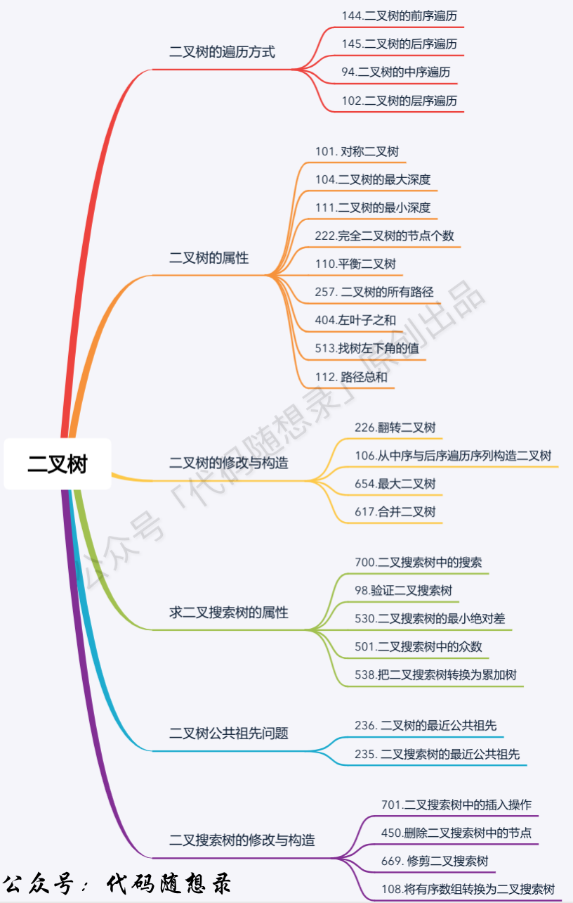
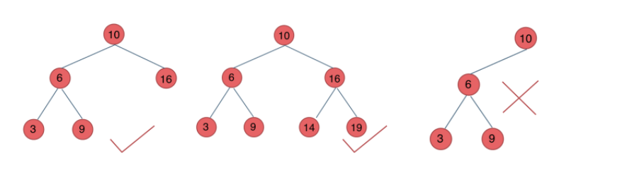
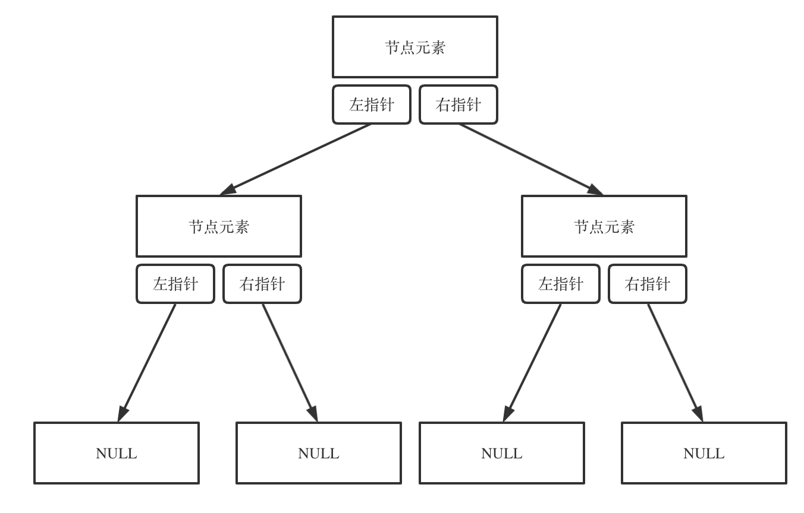
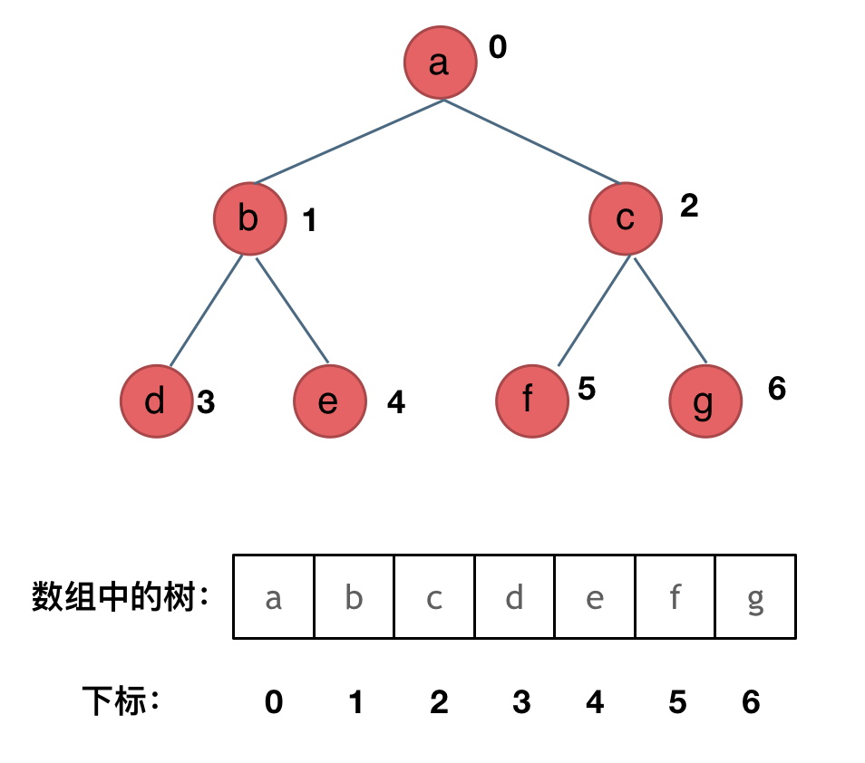
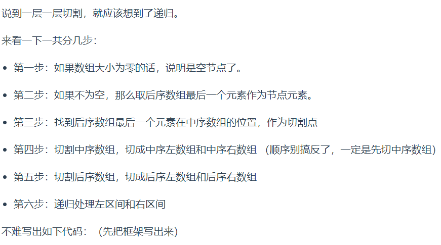

# 二叉树理论基础

  

## 二叉树种类

解题过程中主要两种形式：满二叉树和完全二叉树  
满二叉树：一课二叉树只有度为0和度为2的结点，且度为0的结点在同一层上。  
完全二叉树：除了最底层节点可能没填满外，其余每层节点数都达到最大值，并且最下面一层的节点都集中在该层最左边的若干位置。  
*优先级队列其实是一个堆，堆就是一课完全二叉树*  
二叉搜索树：二叉搜索树是一个有序树。  

1. 左子树上所有结点的值均小于它的根结点的值。
2. 右子树上所有结点的值均大于它的根结点的值。
3. 其左、右子树也分别为二叉搜索（排序）树。

平衡二叉搜索树（AVL Adelson-Velsky and Landis）：其是一课空树或它的左右两个子树的高度差的绝对值不超过1 。
  

C++中map、set、multimap，multiset的底层实现都是 ***平衡二叉搜索树*** ，所以map、set的增删操作时间时间复杂度是logn  
unordered_map、unordered_set底层实现是哈希表。  

## 二叉树的存储方式

可链式存储（指针），也可顺序存储（数组）  

  
  

## 二叉树的遍历方式

深度优先遍历、广度优先遍历  

- 深度优先遍历  
  前序遍历（递归法，迭代法）中左右  
  中序遍历（递归法，迭代法）左中右  
  后序遍历（递归法，迭代法）左右中  
- 广度优先遍历
  层次遍历（迭代法）

前中后，其实指的是中间节点的遍历顺序。  

栈其实是递归的一种实现结构，也就是说前中后序遍历的逻辑其实可以借助栈，非递归的方式来实现。  
广度优先遍历的实现一般使用队列来实现。因为需要先进先出的结构，才能一层一层的来遍历二叉树。  

## 二叉树的定义

链式存储的二叉树节点的定义方式：

    struct TreeNode{
        int val;
        TreeNode *left;
        TreeNode *right;
        TreeNode(int x) : val(x), left(NULL), right(NULL) {}
    };

相对于链表，二叉树的节点里多了一个指针。两个指针，指向左右孩子。  
注意二叉树节点定义的书写方式。（手撕代码）  

## 不同遍历方法

### 二叉树的递归遍历

#### 递归法

递归算法需要方法论，前后中序的递归写法。**递归算法三要素**  

1. **确定递归函数的参数和返回值**：确定哪些参数是递归过程中需要处理的，在递归函数里加上这个参数。并且要明确每次递归的返回值是什么，进而确定递归函数的返回类型。  
2. **确定终止条件**：栈溢出错误通常是没写终止条件或终止条件不对。  
3. **确定单层递归的逻辑**：确定每一层递归需要处理的信息。

前序遍历为例：

     void traversal(TreeNode * cur, vector<int> & vec)
终止条件：

    if(cur == NULL) return;
单层递归逻辑：

    vec.push_back(cur->val);    中
    traversal(cur->left, vec);       左
    traversal(cur->right, vec);      右

#### 迭代法（非递归）

用栈实现二叉树的前中后序遍历。  
**重点** 同一风格的迭代法遍历，后序遍历

    class Solution {
    public:
        vector<int> postorderTraversal(TreeNode* root) {
            vector<int> result;
            stack<TreeNode*> st;
            if (root != NULL) st.push(root);
            while (!st.empty()) {
                TreeNode* node = st.top();
                if (node != NULL) {
                    st.pop();
                    st.push(node);                          // 中
                    st.push(NULL);//插入空格作为要处理的标志

                    if (node->right) st.push(node->right);  // 右
                    if (node->left) st.push(node->left);    // 左

                } else {
                    st.pop();
                    node = st.top();
                    st.pop();
                    result.push_back(node->val);
                }
            }
            return result;
        }
    };

#### 层序遍历

二叉树的层序遍历，就是图论中的广度优先搜索在二叉树的应用。  
*层序遍历*需借助一个辅助数据结构，即*队列*来实现。  
队列先进先出，符合一层一层遍历的逻辑；而栈先进后出，适合模拟深度优先遍历（递归）的逻辑。  模板代码

    class Solution {
    public:
        vector<vector<int>> levelOrder(TreeNode* root) {
            queue<TreeNode *> que;
            if (root != nullptr) que.push(root);
            vector<vector<int> > result;    //重点
            while (!que.empty()) {
                int size = que.size();      //size需固定，很重要
                vector<int> vec;

                for (int i = 0; i < size; i ++) {   //size和for循环
                    TreeNode * cur = que.front();
                    que.pop();
                    vec.push_back(cur->val);
                    if (cur->left) que.push(cur->left);
                    if (cur->right) que.push(cur->right);
                }
                result.push_back(vec);
            }
            return result;

        }
    };

递归法：

    class Solution {
    public:
        void order(TreeNode* cur, vector<vector<int>>& result, int depth)
        {
            if (cur == nullptr) return;
            if (result.size() == depth) result.push_back(vector<int>());
            result[depth].push_back(cur->val);
            order(cur->left, result, depth + 1);
            order(cur->right, result, depth + 1);
        }
        vector<vector<int>> levelOrder(TreeNode* root) {
            vector<vector<int>> result;
            int depth = 0;
            order(root, result, depth);
            return result;
        }
    };

## 翻转二叉树

针对二叉树问题，解题之前一定要想清楚究竟是*前中后序遍历，还是层序遍历*。  

## 判断递归函数的返回值方法

- 如果需要搜索整颗二叉树且*不用*处理递归返回值，递归函数就不要返回值。
- 如果需要搜索整颗二叉树且*需要*处理递归返回值，递归函数就需要返回值。
- 如果要搜索其中一条符合条件的路径，递归函数一定需要返回值（因为找到后就要及时终止）。

## 构造二叉树

前序和中序  
后序和中序  
为什么前序和后序不能唯一构成一棵二叉树，因为没有中序遍历就无法确定左右部分，也就无法分割。  

  

    TreeNode* traversal (vector<int>& inorder, vector<int>& postorder) {

    // 第一步
    if (postorder.size() == 0) return NULL;

    // 第二步：后序遍历数组最后一个元素，就是当前的中间节点
    int rootValue = postorder[postorder.size() - 1];
    TreeNode* root = new TreeNode(rootValue);

    // 叶子节点
    if (postorder.size() == 1) return root;

    // 第三步：找切割点
    int delimiterIndex;
    for (delimiterIndex = 0; delimiterIndex < inorder.size(); delimiterIndex++) {
        if (inorder[delimiterIndex] == rootValue) break;
    }

    // 第四步：切割中序数组，得到 中序左数组和中序右数组
    // 第五步：切割后序数组，得到 后序左数组和后序右数组

    // 第六步
    root->left = traversal(中序左数组, 后序左数组);
    root->right = traversal(中序右数组, 后序右数组);

    return root;
    }

寻找边界值时，坚持区间预设。  

    class Solution {
    private:
        TreeNode* traversal (vector<int>& inorder, vector<int>& postorder) {
            if (postorder.size() == 0) return NULL;

            // 后序遍历数组最后一个元素，就是当前的中间节点
            int rootValue = postorder[postorder.size() - 1];
            TreeNode* root = new TreeNode(rootValue);

            // 叶子节点
            if (postorder.size() == 1) return root;

            // 找到中序遍历的切割点
            int delimiterIndex;
            for (delimiterIndex = 0; delimiterIndex < inorder.size(); delimiterIndex++) {
                if (inorder[delimiterIndex] == rootValue) break;
            }

            // 切割中序数组
            // 左闭右开区间：[0, delimiterIndex)
            vector<int> leftInorder(inorder.begin(), inorder.begin() + delimiterIndex);
            // [delimiterIndex + 1, end)
            vector<int> rightInorder(inorder.begin() + delimiterIndex + 1, inorder.end() );

            // postorder 舍弃末尾元素
            postorder.resize(postorder.size() - 1);

            // 切割后序数组
            // 依然左闭右开，注意这里使用了左中序数组大小作为切割点
            // [0, leftInorder.size)
            vector<int> leftPostorder(postorder.begin(), postorder.begin() + leftInorder.size());
            // [leftInorder.size(), end)
            vector<int> rightPostorder(postorder.begin() + leftInorder.size(), postorder.end());

            root->left = traversal(leftInorder, leftPostorder);
            root->right = traversal(rightInorder, rightPostorder);

            return root;
        }
    public:
        TreeNode* buildTree(vector<int>& inorder, vector<int>& postorder) {
            if (inorder.size() == 0 || postorder.size() == 0) return NULL;
            return traversal(inorder, postorder);
        }
    };

## 二叉搜索树新方法

与数值处理相关，保存至数组，而后进行处理。  
