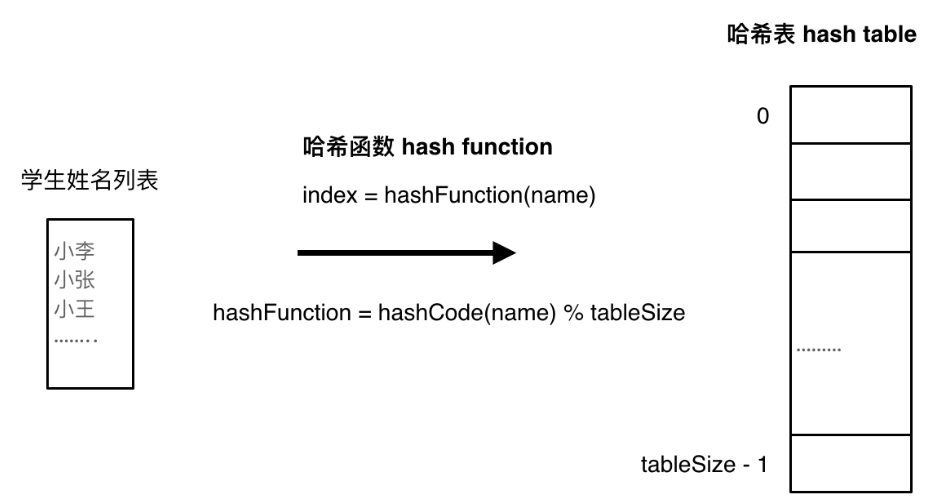
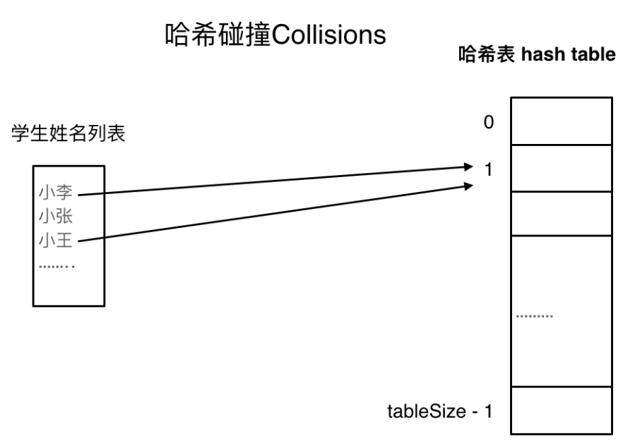
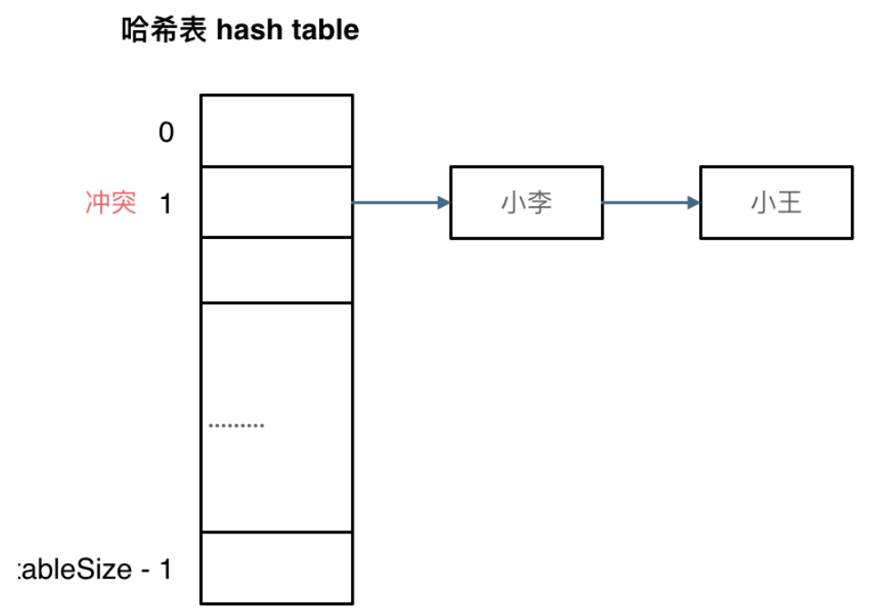
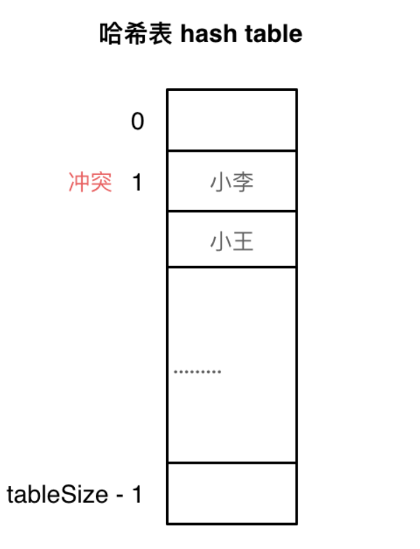

# 哈希表（散列表）

## 1 理论基础

哈希表是根据关键码的值而直接进行访问的数据结构  

***用途：哈希表用于快速判断一个元素是否出现集合里***  
***牺牲了空间换取了时间***，需要使用额外的 *数组，set或map* 来存放数据  
需要判断一个元素是否出现过的场景应第一时间想到哈希法。  

将学生姓名映射到哈希表上就涉及到了hash function ，也就是 *哈希函数*  

### 哈希函数

hashcode通过特定编码方式，可以将其它数据格式转化为不同的数值，把学生名字映射为哈希表上的索引数字。  

### 哈希碰撞

  

#### 拉链法  

需要选择适当的哈希表的大小，既不会因为数组空值而浪费大量内存，也不会因为链表太长而在查找上浪费太多时间  
  

#### 线性探测法  

常见的三种哈希结构：

1. 数组
2. set（集合）  
3. map（映射）
