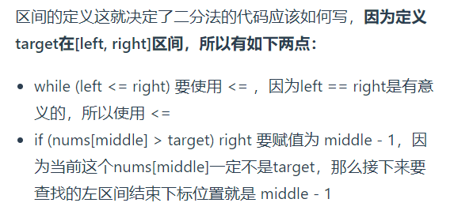

# 数组

数组的元素不是删的，是覆盖的  
二维数组在内存的空间地址是连续的  

## 二分查找

前提条件：有序数组， 无重复元素  
主要关注边界条件  
大家写二分法经常写乱，主要是因为对 *区间的定义没有想清楚，区间的定义就是不变量*。要在二分查找的过程中，保持不变量，就是在while寻找中每一次边界的处理都要坚持根据区间的定义来操作，这就是 *循环不变量*规则。

写二分法，区间的定义一般为两种，*左闭右闭即[left, right]*，或者左闭右开即[left, right)。  
  

希望通过这道题目，大家会发现平时写二分法，为什么总写不好，就是因为对区间定义不清楚。

确定要查找的区间到底是左闭右开[left, right)，还是左闭又闭[left, right]，这就是不变量。

然后在二分查找的循环中，坚持循环不变量的原则，很多细节问题，自然会知道如何处理了

相关变形：  

1. 35搜索插入位置  
2. 34在排序数组中查找元素的第一个和最后一个位置  
3. 69x的平方根  
4. 367有效的完全平方数  

## 移除元素

双指针法：  

1. 26删除排序数组中的重复项  
2. 283 移动零  
3. 844 比较含退格的字符串  
4. 977 有序数组的平方