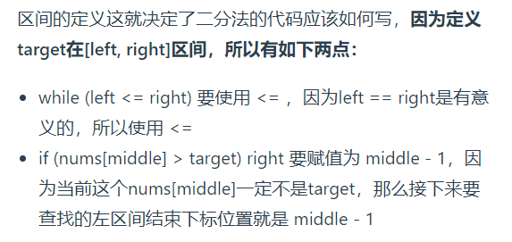
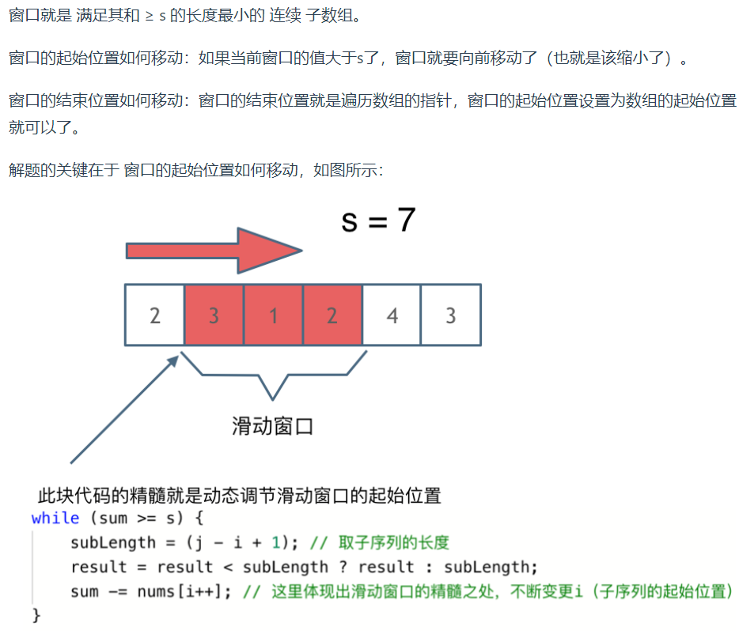

# 数组

*考察数组的题目一般在思维上都不难，主要是考察对代码的掌控能力*嗯  

* 存储方式：下标从0，地址连续  
* 数组的元素不是删的，是覆盖的  
* 二维数组在内存的空间地址是连续的  
* 方法：二分法；双指针法；滑动窗口法；模拟行为  

## 1 二分查找

前提条件：有序数组， 无重复元素  
主要关注边界条件  
大家写二分法经常写乱，主要是因为对 *区间的定义没有想清楚，区间的定义就是不变量*。要在二分查找的过程中，保持不变量，就是在while寻找中每一次边界的处理都要坚持根据区间的定义来操作，这就是 *循环不变量*规则。

写二分法，区间的定义一般为两种，*左闭右闭即[left, right]*，或者左闭右开即[left, right)。  
  

希望通过这道题目，大家会发现平时写二分法，为什么总写不好，就是因为对区间定义不清楚。

确定要查找的区间到底是左闭右开[left, right)，还是左闭又闭[left, right]，这就是不变量。

然后在二分查找的循环中，坚持循环不变量的原则，很多细节问题，自然会知道如何处理了

相关变形：  

1. 35搜索插入位置  
2. 34在排序数组中查找元素的第一个和最后一个位置  
3. 69x的平方根  
4. 367有效的完全平方数  

## 2 移除元素

双指针法：  

1. 26删除排序数组中的重复项  
2. 283 移动零  
3. 844 比较含退格的字符串  
4. 977 有序数组的平方

## 3 有序数组的平方

双指针法，可以另起一个新的vector存储结果  

## 5 长度最小的子数组  

数组操作中另一个重要的方法：滑动窗口  
三个重点：  

1. 窗口内是什么
2. 如何移动窗口的起始位置
3. 如何移动窗口的结束位置

滑动窗口  
  

## 6 螺旋矩阵

坚持 *循环不变量* 原则  
确定好边界规则 *左闭右开，左闭右闭* 就不要再改动（以便于确定边界操作）  
