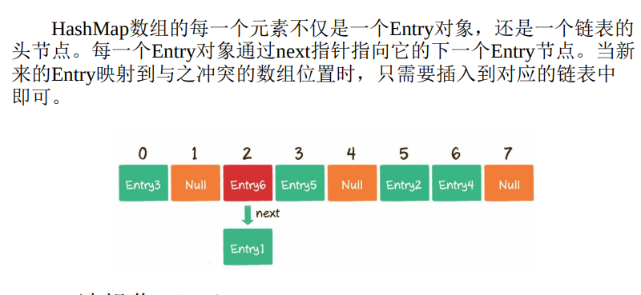

# 什么是数据结构

数据的组织、管理和存储方式  
数组、链表可以封装成两种数据结构：栈、队列  
树：一种一对多的数据结构，适合用来检索  
图：多对多的数据结构，适合描述众多对象之间的复杂关系  

在此基础上，出现一些 ***复合数据结构***  

哈希表：数组和链表的结合  
  

跳表：普通链表的基础上，加了多个索引层  
  

## 1 链表

单向链表的每一个节点又包含两部分，一部分是存放数据的变量data，另一部分是指向下一个节点的指针next  

    1. private static class Node {
    2. int data;
    3. Node next;
    4. }

双向链表比单向链表稍微复杂一些，它的每一个节点除了拥有data和next指针，还拥有指向前置节点的prev指针  

## 2 数组&链表

数组的优势在于能够快速定位元素，对于读操作多、写操作少的场景来说，用数组更合适一些  
链表的优势在于能够灵活地进行插入和删除操作，如果需要在尾部频繁插入、删除元素，用链
表更合适一些  
不考虑之前的查找操作，时间复杂度为：  
  

## 3 栈和队列

  

数组实现的队列可以用循环队列方式  
  
  
队列最大容量比数组长度小1  

双端队列：deque  
将栈和队列的特点结合，既可以先入先出，也可以先入后出。  

优先队列：谁的优先级高谁先出队  
基于二叉堆实现  

## 4 散列表（哈希表hash table）

key:value  

### 哈希函数

散列表本质上是一个数组  
  

在不同的语言中，哈希函数的实现方式是不一样的。这里以Java的常用集合HashMap为例，来看一看哈希函数在Java中的实现。  
在Java及大多数面向对象的语言中，每一个对象都有属于自己的hashcode，这个hashcode是区分不同对象的重要标识。无论对象自身的类型是什么，它们的hashcode都是一个整型变量。  
既然都是整型变量，想要转化成数组的下标也就不难实现了。最简单的转化方式是什么呢？是按照数组长度进行取模运算。  

    index = HashCode (Key) % Array.length

通过哈希函数，可以把字符串或其它类型的key，转化为数组的下标 index  

*散列表写操作*

> 通过哈希函数，将Key转化成数组下标5  
> 如果数组下标5对应的位置没有元素，就把这个Entry填充到数组下标5的位置  
> 由于数组的长度是有限的，当插入的Entry越来越多时，不同的Key通过哈希函数获得的下标有可能是相同的(哈希冲突)  
> 哈希冲突是无法避免的，既然不能避免，我们就要想办法来解决。解决哈希冲突的方法主要有两种，一种是开放寻址法，一种是链表法  

开放寻址法：  
  

链表法：  

*散列表读操作*  

  

*散列表扩容* resize  
  

## 5 树

在数据结构中，树的定义如下  
树是n个节点的有限集。 当n=0 时，称为空树  

>1. 有且仅有一个特定的称为根的节点  
>2. 当n>1时，其余节点可分为m(m>0)个互不相交的有限集，每一个集合本身又是一个树，并称为根的子树  

### 二叉树

左孩子(left child),右孩子(right child)  
满二叉树：每一个分支都是满的  
  

完全二叉树：  
  

二叉树属于逻辑结构，可通过多种物理结构来表达  

1. 链式存储结构  
2. 数组  

#### 链式存储结构

  

存储数据的data变量  
指向左孩子的left指针  
指向右孩子的right指针  

#### 数组存储结构

  
使用数组存储时，会按照层级顺序把二叉树的节点放到数组中对应的位置上。如果某一个节点的左孩子或右孩子空缺，则数组的相应位置也空出来  
这样设计，可以更方便的在数组中定位二叉树的孩子节点和父节点  
假设一个父节点的下标是parent，那么它的左孩子节点下标就是2×parent + 1；右孩子节点下标就是2×parent + 2  
同理：有了子节点下标child，其父节点计算方法是：(child - 1)/2 整数除法，左右子节点相同  

#### 二叉查找(排序)树

binary search(sort) tree  
二叉查找树在二叉树的基础上增加了以下几个条件:  

1. 如果左子树不为空，则左子树上所有节点的值均小于根节点的值  
2. 如果右子树不为空，则右子树上所有节点的值均大于根节点的值  
3. 左、右子树也都是二叉查找树  

查找 复杂度为O(logn)  
*二叉树自平衡* 后续再看  

### 二叉树遍历

1. 前序遍历  
2. 中序遍历  
3. 后序遍历  
4. 层序遍历  

深度优先遍历（前序遍历、中序遍历、后序遍历）  
广度优先遍历（层序遍历）  

这3种遍历方式的区别，仅仅是输出的执行位置不同：前序遍历的输出在前，中序遍历的输出在中间，后序遍历的输出在最后  

绝大多数可以用递归解决的问题，其实都可以用另一种数据结构来解决，及栈。  

### 二叉堆

二叉堆本质上是一种完全二叉树，分为 *最大堆* 和 *最小堆*  

最大堆：最大堆的任何一个父节点的值，都大于或等于它左右孩子节点的值  
最小堆：最小堆的任何一个父节点的值，都小于或等于它左右孩子节点的值  
二叉堆的根节点叫做堆顶  

#### 二叉堆的自我调整

插入节点、删除节点、构建二叉堆  

二叉堆是实现堆排序及优先队列的基础。  

### 优先队列

正常队列，先进先出  
优先队列：  
最大优先队列，无论入队顺序如何，都是当前最大的元素优先出队  
最小优先队列，无论入队顺序如何，都是当前最小的元素优先出队  

具体实现，通过二叉堆实现。  

